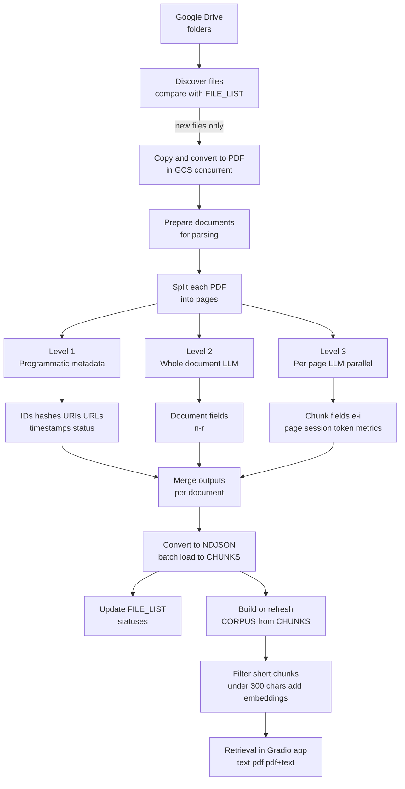

# AI Knowledge Base on GCP: Multimodal Parsing with Gemini and RAG via BigQuery + LangChain

## Project Context

- Timeline: second half of 2024 to early 2025.
- Domain: Industrial manufacturing (industry articles, journals, presentations).
- Initial scale: ~10,000 documents (mostly PDF, DOC/DOCX, PPT/PPTX, spreadsheets/presentations converted to PDF).
- Platform constraint: full implementation on Google Cloud Platform (GCP).

## Business Goal

Build a searchable internal knowledge base for marketing teams so they can quickly validate hypotheses and factual claims against proprietary documents that are not publicly available online.

Key organizational constraint: keep the existing upload process unchanged. Specialists continue dropping files into Google Drive folders approximately once per month; the pipeline ingests updates automatically.

## Why This Architecture

- Multimodal parsing with Gemini 1.5 Flash was chosen to capture not only plain text but also tables, charts, diagrams, and technical images.
- Controlled JSON generation was used to enforce structured extraction.
- At project start, native RAG Corpus was not available in required EU GCP zones, so the stack used:
  - BigQuery as storage + vector index layer
  - LangChain (`langchain_google_community.BigQueryVectorStore`) for corpus updates and vector retrieval orchestration
  - GCS for source and intermediate artifacts
  - Vertex AI Gemini for parsing and answering
- App supports hybrid retrieval (`pdf+text`) so newer models can re-read source PDFs on the fly and compensate for imperfect offline parsing.
- This setup was selected for affordability (BigQuery free-tier-friendly for this workload) and future scalability: retrieval can be moved to Feature Store for lower-latency serving if needed.

## Repository Structure

Core project files:

1. `01_setup_bq_file_list.ipynb`  
   One-time setup notebook creating the BigQuery file registry table (`FILE_LIST`-style table).
2. `02_setup_bq_chunks.ipynb`  
   One-time setup notebook creating the BigQuery chunks table (`CHUNKS` / corpus table).
3. `03_parsing_tool.ipynb`  
   Main scheduled Colab Enterprise pipeline:
   - detects new files in Drive
   - copies/converts to PDF into GCS
   - parses document-level and page-level content via Gemini
   - stores JSON/NDJSON in GCS
   - batch loads into BigQuery
   - updates statuses in file registry
   - updates vector store with new eligible chunks via LangChain `BigQueryVectorStore.add_documents`
4. `04_analyze_chunks_optional.ipynb`  
   Optional analytics notebook for chunk length distribution and CSV exports by character ranges.
5. `05_app_gradio.py`  
   Gradio chatbot app with retrieval modes: `no_context`, `text`, `pdf`, `pdf+text`.
6. `06_Dockerfile`  
   Containerization for Cloud Run deployment.

## End-to-End Pipeline

1. Discover files in Google Drive folders.
2. Compare against file registry table (new vs already tracked).
3. Copy new files to GCS and convert supported formats to PDF (with concurrent Drive->GCS copying).
4. Parse each document in three layers (with concurrent document/page ingestion to Gemini within API limits):
   - Programmatic prep layer (`metadata["properties"]`): IDs, hashes, links, layout, and session metadata
   - Document LLM layer (`gen_result`): title/author/type/keywords/summary
   - Page layer (`all_chunks`): object-centric chunk extraction with page-level and session fields
5. Save intermediate JSON artifacts to GCS (document-level, page-level, merged).
6. Merge per-document outputs into session NDJSON.
7. Batch load NDJSON into BigQuery chunks table.
8. Update file registry statuses (`copied_to_gcs`, `parsed`, `added_to_bq`, timestamps).
9. Add new chunks to BigQuery vector store via LangChain `BigQueryVectorStore` (filtering out very short chunks, e.g. <300 chars).

## Parsing Design

### Parsing Logic by Derivation Source

#### 1) Programmatic foundation (non-LLM, first)

Programmatic extraction creates the operational backbone of each record: stable IDs, file/page links, hashes, session timestamps, status flags, and token/model telemetry.  
This layer is deterministic and is used for traceability, reruns, debugging, and cost analysis.

#### 2) Whole-document LLM pass (second)

A single pass over the full document extracts global context that page-level parsing cannot reliably infer:

- document name
- author
- type
- document-level keywords
- document-level summary

These fields are then attached to chunk records to improve grouping, thematic search, and retrieval context quality.

#### 3) Per-page LLM chunk pass (third)

Each page is parsed independently to avoid long-document token compression/truncation and to preserve local detail.  
Chunking is object-centric rather than length-centric, with chunk types:

- `text`
- `table`
- `chart`
- `diagram`
- `image` (with filtering of irrelevant visuals when possible)

For each chunk, the model extracts type/title/content/keywords/summary using a fixed JSON schema.

Both LLM passes (whole-document and per-page) use schema-constrained JSON outputs, then programmatic metadata is merged before loading to BigQuery.

For exact field-level mapping (`a_` to `ar_`) and ownership (programmatic vs LLM), see the field map table below.

### Field Map (`a_` to `ar_`)

The table below maps all schema fields to:

- scope: `Document` or `Page`
- derivation: LLM vs programmatic
- intent: what the field is used for

| Field | Scope | Derived By | Purpose |
|---|---|---|---|
| `a_chunk_id` | Page | Programmatic | Generated as UUID (`uuid4`) |
| `b_page_number` | Page | Programmatic | Page-level citation and navigation |
| `c_file_pages` | Document | Programmatic | Completeness checks and pagination validation |
| `d_document_date` | Document | LLM | Time-based filtering and trend analysis |
| `e_chunk_type` | Page | LLM | Modality-aware retrieval and routing |
| `f_chunk_title` | Page | LLM | Better snippet readability and ranking hints |
| `g_chunk_contents` | Page | LLM | Main searchable text for embeddings and retrieval |
| `h_chunk_keywords` | Page | LLM | Recall boost for sparse or domain-specific queries |
| `i_chunk_summary` | Page | LLM | Fast preview and reranking signal |
| `j_file_number` | Document | Programmatic | Generated as sequential numeric prefix |
| `k_file_hash` | Document | Programmatic | Generated as SHA-256 hash |
| `l_file_name` | Document | Programmatic | Human-readable identifier in UI/results |
| `m_file_layout` | Document | Programmatic | Parsing diagnostics by layout/orientation |
| `n_document_name` | Document | LLM | Corpus grouping and source attribution |
| `o_document_author` | Document | LLM | Author-based filtering and credibility context |
| `p_document_type` | Document | LLM | Type-based filtering (`Research Paper`, `Report`, `Presentation`, `Publication`, `Technical Documentation`, `Other`) |
| `q_document_keywords` | Document | LLM | Thematic indexing at document level |
| `r_document_summary` | Document | LLM | High-level context for ranking and answers |
| `s_page_gsutil` | Page | Programmatic | Direct page file access for multimodal calls |
| `t_page_url` | Page | Programmatic | Click-through evidence link for users |
| `u_file_gsutil` | Document | Programmatic | Direct full-document file access |
| `v_file_url` | Document | Programmatic | Browser access to full source |
| `w_file_session_start` | Document | Programmatic | Start marker for runtime tracking |
| `x_file_session_end` | Document | Programmatic | End marker for runtime tracking |
| `y_file_session_duration` | Document | Programmatic | Processing latency monitoring |
| `z_file_session_status` | Document | Programmatic | Retry/control decisions and alerting |
| `aa_document_session_id` | Document | Programmatic | Generated as UUID (`uuid4`) for document-level session tracking |
| `ab_document_session_start` | Document | Programmatic | Timing audit for document-stage inference |
| `ac_document_session_end` | Document | Programmatic | Timing audit for document-stage inference |
| `ad_document_session_duration` | Document | Programmatic | Duration metric for document-stage inference |
| `ae_chunks_session_id` | Page | Programmatic | Generated as UUID (`uuid4`) for page-level session tracking |
| `af_chunks_session_start` | Page | Programmatic | Timing audit for page-stage inference |
| `ag_chunks_session_end` | Page | Programmatic | Timing audit for page-stage inference |
| `ah_chunks_session_duration` | Page | Programmatic | Duration metric for page-stage inference |
| `ai_document_finish_reason` | Document | Programmatic | Diagnose stop conditions in model output |
| `aj_chunks_finish_reason` | Page | Programmatic | Diagnose stop conditions in model output |
| `ak_document_prompt_token_count` | Document | Programmatic | Prompt-side cost tracking |
| `al_chunks_prompt_token_count` | Page | Programmatic | Prompt-side cost tracking |
| `am_document_candidates_token_count` | Document | Programmatic | Output-side cost tracking |
| `an_chunks_candidates_token_count` | Page | Programmatic | Output-side cost tracking |
| `ao_document_total_token_count` | Document | Programmatic | Total token budget monitoring |
| `ap_chunks_total_token_count` | Page | Programmatic | Total token budget monitoring |
| `aq_document_model_version` | Document | Programmatic | Reproducibility and regression comparison |
| `ar_chunks_model_version` | Page | Programmatic | Reproducibility and regression comparison |

### Parsing Flow Diagram

## BigQuery Data Model (High Level)

### File registry table (`01_setup_bq_file_list.ipynb`)

Tracks ingestion lifecycle per source file, including:

- file identity (`file_id`, `file_name`, path, MIME type, size)
- source metadata (created time, folder linkage, Drive link)
- pipeline flags/timestamps (`copied_to_gcs`, `parsed`, `added_to_bq`, timestamps)

### Chunks table (`02_setup_bq_chunks.ipynb`)

`CHUNKS` is the canonical parsed/intermediate table (full raw chunk metadata + lineage), used as backup/reference and for audits.

Retrieval is performed from `CORPUS` (created in `03_parsing_tool.ipynb` when initializing/updating BigQuery vector store via LangChain `BigQueryVectorStore`), not directly from `CHUNKS`.

`CORPUS` is effectively a filtered/vectorized projection of `CHUNKS`:

- rows with very short content are filtered out (e.g., `<300` chars)
- embeddings are attached
- table is optimized for vector similarity search

`CHUNKS`/`CORPUS` together provide both traceability and fast retrieval.

Stored metadata includes:

- chunk/page/document descriptors
- document-level fields (name, author, type, keywords, summary)
- GCS and URL pointers (`s_page_gsutil`, `t_page_url`, `u_file_gsutil`, `v_file_url`)
- session and token accounting fields

## Application Modes (`05_app_gradio.py`)

- `no_context`: pure LLM answer.
- `text`: retrieved chunks from BigQuery vector store using LangChain `BigQueryVectorStore.similarity_search_with_score`.
- `pdf`: retrieved relevant PDFs sent as multimodal inputs directly to Gemini.
- `pdf+text`: combines LangChain text retrieval with direct PDF multimodal inputs.

The app also returns:

- retrieved chunk content with similarity scores
- links to specific pages
- links to full documents in GCS

## Deployment

- `05_app_gradio.py` is packaged with `06_Dockerfile`.
- Container is published to GCP Container/Artifact Registry.
- Service runs on Cloud Run with autoscaling and concurrent access.

## Setup Notes

This repository is sanitized with placeholders (e.g., `your-project-id`, secret names, sample folder IDs). Before running:

1. Configure GCP project, IAM, APIs, and ADC/service account auth.
2. Create/update Secret Manager entries used in notebooks.
3. Replace placeholder project, dataset, table, bucket, and folder IDs.
4. Run notebooks in order:
   - `01_setup_bq_file_list.ipynb` (once)
   - `02_setup_bq_chunks.ipynb` (once)
   - `03_parsing_tool.ipynb` (scheduled recurring run)
   - `04_analyze_chunks_optional.ipynb` (optional)
5. Deploy app (`05_app_gradio.py`) with `06_Dockerfile` via Docker/Cloud Run.

## Practical Value of the Hybrid Mode

Because models improve over time, `pdf` / `pdf+text` allows the system to leverage the latest multimodal reasoning during query time, even when historical offline parsing missed details. This improves answer quality without reprocessing the entire corpus on every model update.

## License

This project is licensed under the MIT License. See `LICENSE` for details.
